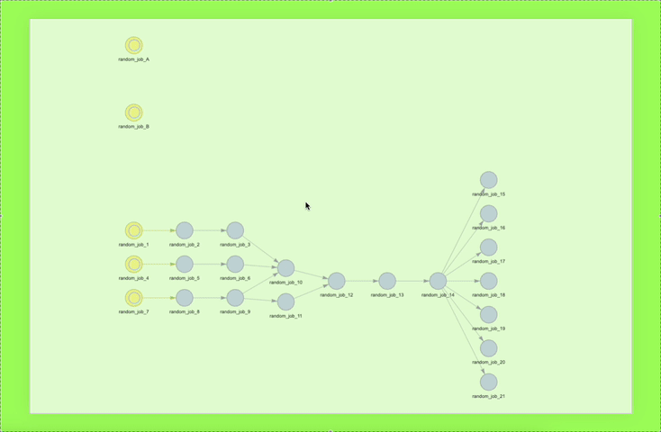
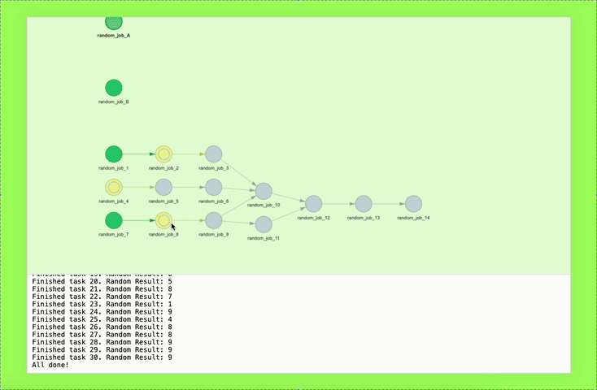

# ~~Unity~~ General CICD
*Originally a lightweight Unity CI pipeline, turned into a general purpose DAG orchestration framework.*

> *Tested on Apple Silicon with python 3.13.9 (brew installed)*

<p align="center">
  </img>
</p>

## How to run:
```bash
# assuming we're at project root
python Orchestration/app.py
```

This will launch a tkinter file dialog. Select any of the YAML workflow configs in Orchestration/demo. It will launch the backend, start the workflow, and open a browser to the frontend at localhost:8200. You can bind the backend to all interfaces if you want to access it from another device; it works great.

## Features
### Console Output Per Node
<p align="center">
  </img>
</p>

### Terminates Workflow On Single Failure
<p align="center">
  </img>
</p>

### Parallel Worker Threads (5 workers in the gif)
<p align="center">
  </img>
</p>

### Additional Info:
- Runs logged under Orchestration/db and Orchestration/blob
- Cyclic dependencies will be detected and will terminate workflow
- DAG scheduler standalone script: [`orchestrate_DAG.py`](./Orchestration/orchestrate_DAG.py) 
- DAG scheduler with interactive web visualization and live console output: [`app.py`](./Orchestration/app.py) 

## Unity Stuff
Currently working on:
- Automating version bump and patch-notes update for Unity builds.
- Documentation for environment setup coming soon. However, this is still a working prototype minus the Android build script on the Unity's side (MacOS server build script is available as a sample template, See [`MacOSServerBuildCommand.cs`](./SampleEditorBuildScripts/MacOSServerBuildCommand.cs)).

## Design Philosophies:

1. A shell script should have a single responsibility. Whether it’s testing, building, or any other task, a shell script should only do that one thing.
2. A Python script will serve one of two purposes:
    - act as a procedure that glues together various shell scripts, or
    - act as a dependency for procedural Python scripts.
3. There is no single app entry point. Every python script can be its own entry point and can invoke other scripts in turn. We can make their behaviors consistent by making all file operations relative to a script's (both shell and python) absolute path.
4. *We can have our cake and eat it too*: standalone scripts that still share a consistent internal import space.
    - Normally, relative imports behave differently depending on which script is executed first. An import that works when you run A.py directly might fail if you instead run B.py and B imports A. That’s because Python builds its import search paths (sys.path) based on the location of the entry script, the file passed to python. Any subsequent imports use that fixed set of paths, not the paths of the imported modules. As a result, the moment a script is imported rather than executed, its relative imports may no longer resolve the same way.
    - However, by forcing every script to bootstrap sys.path so that it always points to the project’s root directory rather than where the script resides, we can achieve consistent import patterns that are purely relative to the project root. This isn’t a typical pattern by any means, but it allows us to mix and match procedural programming with object-oriented programming in a predictable and reliable manner. Instead of having to wrap every little one-off script in functions or classes and wire them through a main app, we can simply subprocess these scripts while retaining the benefit of accessing internal tools without the overhead of packaging.
5. File operations should be consistent. Every script should behave the same no matter where it’s executed from. To achieve this, all file paths are resolved relative to the script’s own location using `__file__`, not the current working directory. This ensures that local resources (like configs or build artifacts) are always found in the expected place, regardless of how or where the script is invoked.
6. If you think these points violate OO purity, you’re right. If that bothers you, this probably isn’t the repo for you. This is not a monolithic, single-entry app, but rather a multi-entry CI/CD system. However, if you do need a flexible CI pipeline for Oculus builds (or really just about anything) and you like gluing together standalone scripts that can still share internal tooling, give this a try (at your own risk 🙂 - still under active development).